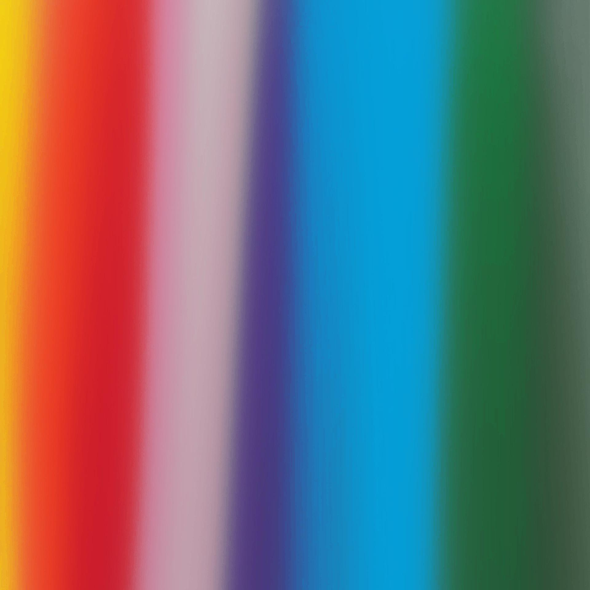

use [gowall](https://github.com/Achno/gowall) to make your wallpaper adhere to your base16/base24 theme.
# Basic Usage Instructions

Add the following toml settings to your Tinty ~/.config/tinted-theming/tinty/config.toml file:

```toml
[[items]]
path = "https://github.com/rwendell/tinted-gowall"
name = "wallpaper"
themes-dir = "themes" 
supported-systems = ["base16", "base24"]
```
This will create a gowall compatible JSON config file that you can then use to apply your theme:

`gowall convert [INPUT] [OPTIONAL OUTPUT] -t <PATH_TO_YOUR_THEME>`

For example with [chicago](https://github.com/rwendell/chicago-theme)

`gowall convert wallpaper.jpg -t base16-chicago-day.json`

<span>

==>

</span>

